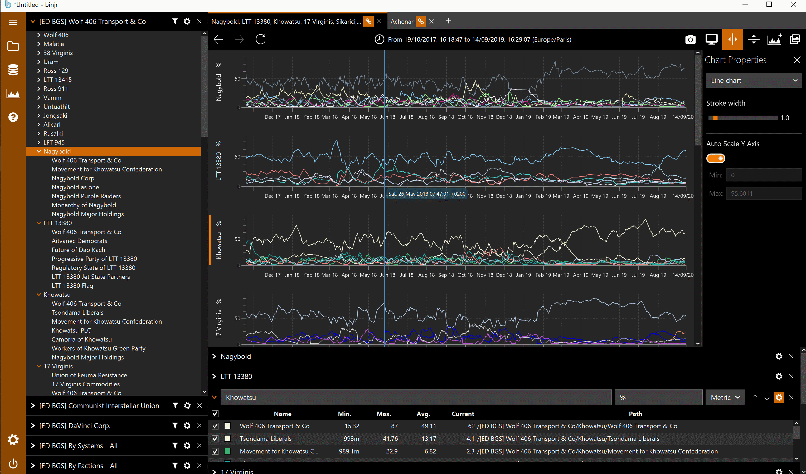

# Elite Dangerous BGS adapter for binjr

  

This is a plugin for [binjr](https://binjr.eu), which allows it to access and visualize some of the data produced by the
 Background Simulation (BGS) of the video game [Elite Dangerous](https://elitedangerous.com) by [Frontier Development](https://frontier.co.uk).

[binjr](https://binjr.eu) is a time series data browser, and together with this plugin you can visualize and navigate 
through Minor Factions' influence over star systems.

In order to achieve this, it connects to and uses the [Elite BGS](https://elitebgs.app/about) website as a backend for
the historical data uploaded by the community through the [Elite Dangerous Data Network](https://github.com/EDSM-NET/EDDN/wiki).

## Getting started

 * First you need to download and install the binjr client application for your platform from https://binjr.eu
 * Download the the latest version of the plugin, available as a .jar file from the [release page](https://github.com/fthevenet/binjr-adapter-elitebgs/releases/latest)
 * Copy the file binjr-adapter-elitebgs-x.x.jar into the `plugins` folder of your binjr installation (if you used the installer on Windows, it will be in `%LOCALAPPDATA%\binjr\plugins` by default).
 * Start binjr, and select "Elite BGS" to add a new data source.

## How to use it

#### 1. Adding a data source
* Start binjr, and in the left hand menu select "Sources > New Source... > Elite Dangerous BGS"
* This will show a dialog box where you can choose in which way the influence data should be presented:
   * **Browse by Systems** will display a tree view of systems matching the filter entered in the dialog, hierachized according to the alphabetical order, and under it a list of factions present in that system.
   * **Browse by Factions** will reversely  display a tree where factions are the upper level and systems they're present in are attached ot it. 
   * **Look for a specific faction** asks you to choose a single faction and will only display systems where that faction has a presence.
   * **Look for a specific system** will let you choose the specific system you're interested in.
* You'll noticed other types of data source as they are bundled with binjr by default; its unlikely will need any of those in this specific context, though the "csv" source is pretty generic and could be used to mixed in some off you own custom data with MF influence (you can add more than one source to a session and mix elements from any sources in a chart).
* If those extra sources bother you, you can hide them via the `Settings > Charts` panel.

#### 2. Adding charts
* You can then drag a whole system branch or individual faction leaves onto the + icon on the right pane to create a new view (called a "worksheet"). Alternatively, right-clicking on a tree branch will invoke a context menu which allows for the same thing.
* You can then drag more factions to plot their influence:
    * If you drop it onto the landing zone with a "chart+" icon at the bottom of the chart view, it will add it to a new chart on the same worksheet.
    * if you drop it onto the landing zone withe a "tab+" icon at the top, it will create a new worksheet (in a new tab) and add the selected factions to it.
    * if you drop it into an existing chart, it will add the selected factions into that chart. You can use that to create a single chart showing a given faction's influence over several systems, for instance, or make a completely custom view of what you what to compare.
    
#### 3. Customizing the view

* You can change the default colour for a faction by clicking the coloured square next to its name on the table view below the charts.
* You can also rename the worksheet or its charts by double clicking on its name.
* On the right hand side is a pane called "Chart Properties" which you can use to change the appearance of each chart individually:
    * Choose a chart type (line, area, stacked or scatter points).
    * Choose line width and area opacity.
    * Choose the constraints on the Y axis.
    
#### 4. Navigating through the data

*  Once you've created a worksheet, you can select the time interval it should show by clicking the clock icon at the top.
* You can also zoom in using the mouse left-click (make sure the axis marker is enabled, using the <|> icon on the toolbar).
* Use the "back" and "forward" arrows to navigate through your viewing history, like in a web browser.
* The "Screen/Cog" icon in the the top left toolbar of a worksheet toggles between the default "edit mode", where the source pane and charts settings are expanded, to a "presentation mode" where the screen real-estate is dedicated to the chart view.
* You can detach a worksheet by dragging its tab outside of the application's window. You can also link the time line of several tabs so that zooming in one will also apply to all linked tab; this is a great way to maximize the viewing space on multi-monitor setups.

#### 5. Saving and sharing your work
* You can save your current session to a file, to reopen it later on; go to the left hand side command menu and select "Workspace > Save".
* Sessions - or "workspace" are stored as XML file with a ".bjr" extension. They are portable, provided that they don't refer to local sources (such as local csv files) and so they can be share with other binjr users.
* For instance, here is the persisted state of the workspace as shown in the screenshots in the previous post (you can copy and paste it into a file saved with a .bjr extention, and then open it with binjr)
* Use "Workspace > New workspace" to start a fresh session.
* The "Camera" icon takes a screen shot of the current worksheet and saves it to disk; it makes it easier to share a specific view.

## Troubleshooting

In the event of something not working as it should, collecting detailed logs may help diagnosis the issue. In order to that, please follow the steps below:
* Bring up the debug console by pressing F12
* Change the log level to a desired verbosity (it is set on INFO by default; set it to DEBUG or TRACE)
* Reproduce the steps that lead to the issue; hopefully some helpful insights will have been captured in the log window now that the verbosity has been increased
*  If you cannot make sense of what the logs says on your own, you can save the content of the log window (click the "disk" icon, on the top left) and join it to a ticket opened at https://github.com/fthevenet/binjr-adapter-elitebgs/issues

## Getting Help

If you encounter a bug when using the software or would like to request a specific feature, please open an issue the project's Github issue tracker: https://github.com/fthevenet/binjr-adapter-elitebgs/issues

An other option to ask questions, provide suggestions or more generally discuss this is to do so on the Frontier ED forum, on this thread :https://forums.frontier.co.uk/threads/a-time-series-browser-for-minor-faction-influence-data.519814/

## License

The Elite BGS adapter for binjr is copyright 2019 Frederic Thevenet.  
Licensed under the terms of the [Apache License version 2.0](https://apache.org/licenses/LICENSE-2.0).

This is an open source, community driven project and is not affiliated with or endorsed by [Frontier Development](https://frontier.co.uk).
 
